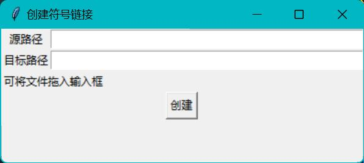

# mk-link


mk-link 是我为了学习 Python 编写 GUI 应用的项目，它利用了 Python 3 和 Tkinter 库。该应用旨在简化在 Windows 平台上创建符号链接的过程。

## 功能特点

- 简化创建符号链接的步骤
- 提供直观的用户界面，方便操作和导航
- 兼容 Python 3.x 和 Tkinter 8.6 版本

## 安装和使用

### 先决条件

确保已经安装以下软件：

- Python 3.x：[官方下载链接](https://www.python.org/downloads/)
- Tkinter 8.6：通常已经随 Python 一同安装

### 安装步骤

1. 克隆或下载该项目的源代码到本地计算机。
2. 进入项目文件夹。
3. 安装所需的 Python 依赖项：
   ```shell
   pip install -r requirements.txt
   ```

### 使用说明

1. 打开终端或命令提示符。
2. 导航到项目文件夹。
3. 运行应用：
   ```shell
   python main.py
   ```
4. 在应用界面上按照需要的选项和路径，创建符号链接。

### 截图



## 许可证

该项目采用 [MIT 许可证](LICENSE)进行许可。

---